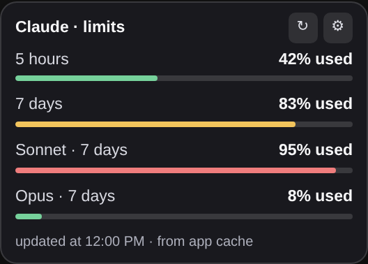
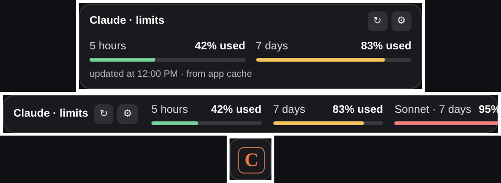
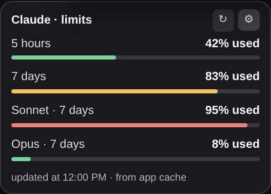

# Claude Limits

Плавающая панель с расходом лимитов вашего плана Claude, прижатая к углу окна
Claude Desktop. Появляется при запуске приложения и закрывается вместе с ним.

*[English version](README.md)*



Ставится обычным расширением Claude Desktop (`.mcpb`). Приложение не изменяется,
поэтому его обновления панель не ломают, а после удаления расширения в системе
ничего не остаётся.

## Содержание

- [Что показывает](#что-показывает)
- [Требования](#требования)
- [Установка](#установка)
- [Работа с панелью](#работа-с-панелью)
- [Инструменты в чате](#инструменты-в-чате)
- [Откуда берутся данные](#откуда-берутся-данные)
- [Ограничения](#ограничения)
- [Настройки и переменные окружения](#настройки-и-переменные-окружения)
- [Если что-то не работает](#если-что-то-не-работает)
- [Сборка из исходников](#сборка-из-исходников)
- [Структура репозитория](#структура-репозитория)
- [Лицензия](#лицензия)

## Что показывает

По одной полосе на каждое окно лимита, которое отдаёт ваш план: **5 часов**,
**7 дней** и отдельные окна моделей (Sonnet, Opus, OAuth apps, Cowork) — когда
приложение их записывает.

Полоса растёт вместе с **расходом**, а не с остатком: пустая — окно не тронуто,
полная — выбрано целиком. Цвет меняется по фиксированным порогам.

| Израсходовано | Цвет |
|---------------|------|
| меньше 80% | зелёный |
| 80–89% | жёлтый |
| 90% и выше | красный |

Четыре вида — карточка, компактный, бар и иконка — переключаются на самой панели:



В режиме иконки левый клик открывает лимиты, правый — настройки.

## Требования

**Расширению** нужен Claude Desktop с поддержкой MCP-расширений и MCP Apps.
Node.js поставляется вместе с приложением, так что для инструментов в чате ничего
доустанавливать не нужно.

**Плавающей панели** дополнительно нужен Linux с сессией X11, а также GTK 3 и
WebKitGTK, доступные из Python:

```bash
# Debian / Ubuntu / Linux Mint
sudo apt install python3-gi gir1.2-gtk-3.0 gir1.2-webkit2-4.1 xdotool

# Fedora
sudo dnf install python3-gobject gtk3 webkit2gtk4.1 xdotool

# Arch
sudo pacman -S python-gobject gtk3 webkit2gtk-4.1 xdotool
```

`xdotool` необязателен: без него панель работает, но встаёт в угол экрана, а не
следует за окном Claude Desktop.

Если чего-то не хватает, приложение продолжает работать как обычно — не
поднимается только панель, а `overlay_status` называет, чего именно не нашлось.

## Установка

1. Скачайте `claude-limits.mcpb` из
   [последнего релиза](../../releases/latest).
2. В Claude Desktop откройте **Settings → Extensions → Advanced → Install
   Extension** и выберите файл. Можно и просто перетащить файл в окно приложения.
3. Включите расширение.
4. **Полностью перезапустите Claude Desktop.** Сервер расширения запускает само
   приложение, поэтому панель появится только после перезапуска.

Для обновления поставьте новый `.mcpb` поверх старого и снова перезапустите
приложение. Для удаления — удалите расширение в том же разделе настроек.
Установка не требует `sudo` и не трогает системные файлы.

## Работа с панелью

Кнопка с шестерёнкой открывает настройки:



- **Вид** — карточка, компактный, бар или иконка.
- **Показывать** — время сброса и время последнего обновления.
- **Размер шрифта** — четыре ступени; масштабируется вся панель, а не только
  текст.
- **Язык** — английский, русский, немецкий или китайский. По умолчанию берётся
  язык системы.

Выбор хранится в `claude-limits-overlay.json` рядом с конфигом Claude и
переживает перезапуск.

Панель обновляется тремя путями: следит за файлом кэша и перерисовывается почти
сразу после его изменения, перечитывает его раз в минуту и обновляется по кнопке
↻. Пока идёт обновление, кнопка показывает `…` — так нажатие заметно, даже если
цифры не изменились.

## Инструменты в чате

| Инструмент | Что делает |
|------------|------------|
| `show_limits` | Показывает панель с расходом лимитов прямо в чате. |
| `get_limits` | Возвращает расход текстом и JSON. |
| `overlay_status` | Запущена ли плавающая панель и почему нет. |
| `overlay_restart` | Перезапускает панель; `off: true` закрывает её. |
| `diagnose` | Какие локальные источники данных и какое окружение найдены. |

## Откуда берутся данные

Наружу ничего не отправляется. Расход читается из файлов на вашей машине:

1. **Кэш использования самого приложения** — `plan-usage-history.json` в каталоге
   конфигурации Claude, который Claude Desktop пишет сам. Это основной источник.
2. **Кэш расширения** — `claude-limits-cache.json` рядом с ним; заполняется,
   когда панели в чате удаётся получить свежие данные.

Каталог конфигурации по платформам:

| Платформа | Путь |
|-----------|------|
| Linux | `~/.config/Claude` |
| macOS | `~/Library/Application Support/Claude` |
| Windows | `%APPDATA%\Claude` |

В кэше окна лимитов лежат под сокращёнными ключами (`fh`, `sd`, `sds`, `sdo`…) —
расширение приводит их к понятным названиям.

## Ограничения

О чём стоит знать до установки:

- **Плавающая панель работает только на Linux с X11.** На Wayland окно не может
  само себя позиционировать, поэтому в угол окна Claude оно не встанет; на macOS
  нужны PyGObject и WebKitGTK, которые там не штатны; на Windows панель не
  запускается вовсе. Инструменты в чате работают везде.
- **Панель показывает только то, что приложение уже записало.** Если Claude
  Desktop ещё не создал свой кэш использования, показывать нечего. Проверить
  наличие файла можно через `diagnose`.
- **В локальном кэше нет времени сброса.** Строки «сброс …» появляются только
  когда данные пришли живым запросом через панель в чате.
- **Незнакомые показатели игнорируются.** Ключ, который не является известным
  окном лимита, не показывается: непонятно, означает он «использовано» или
  «осталось». Такие ключи видны в `diagnose` в поле `unmappedKeys`.
- **Одна панель на машину.** Если Claude Desktop запустит сервер расширения не
  один раз, появится только первая.
- **Формат кэша — не публичный API.** Приложение пишет его для себя и может
  изменить без предупреждения. В этом случае панель сообщит, что данные
  недоступны, вместо того чтобы показывать неверные цифры.
- Это независимый проект, не связанный с Anthropic и не одобренный ею.

## Настройки и переменные окружения

Две настройки живут в карточке расширения в Claude Desktop:

- **Floating panel on startup** — выключает окно, оставляя инструменты чата.
- **Path to python3** — пригодится, если GTK установлен не в тот `python3`,
  который найдётся первым.

Для отладки сервер дополнительно читает:

| Переменная | Смысл |
|------------|-------|
| `CLAUDE_LIMITS_OVERLAY` | `off` / `false` / `0` отключает панель. |
| `CLAUDE_LIMITS_PYTHON` | Интерпретатор для процесса панели. |
| `CLAUDE_LIMITS_REFRESH_MS` | Интервал опроса, минимум 5000, по умолчанию 60000. |
| `CLAUDE_LIMITS_STATE_DIR` | Где хранить настройки панели и файл-замок. |
| `CLAUDE_CONFIG_DIR` | Каталог конфигурации Claude, откуда читать кэш. |

## Если что-то не работает

Начните с `overlay_status` в чате. Он показывает найденные переменные сессии,
интерпретатор, версию WebKit, следит ли панель за окном Claude, и счётчики
данных `pushes` / `lastPush` / `lastPayloadAt`.

| Симптом | Вероятная причина |
|---------|-------------------|
| В `reason` упомянут GTK или python3 | Поставьте пакеты из раздела [Требования](#требования). |
| В `reason` упомянута графическая сессия | Сервер не нашёл `DISPLAY`; обычно он берёт его из процесса приложения. Приложите к отчёту поле `sessionEnv`. |
| Панель работает, но цифры не меняются | Если `pushes` растёт, приложение не обновляет свой кэш — показывать нечего. |
| Панель не в углу окна | Нет `xdotool` либо сессия Wayland, а не X11. |
| После установки вообще ничего | Приложение не перезапускали: сервер стартует только вместе с ним. |

`diagnose` даёт более глубокую картину: какие каталоги и файлы кэша найдены, как
устроен сам кэш и какие ключи остались нераспознанными.

## Сборка из исходников

Пакет — это обычные JavaScript, Python и HTML: ни шага сборки, ни зависимостей.

```bash
git clone https://github.com/maxsoft87/claude-limits.git
cd claude-limits
npx @anthropic-ai/mcpb validate manifest.json
npx @anthropic-ai/mcpb pack . claude-limits.mcpb
```

Полученный `.mcpb` и есть файл для установки.

## Структура репозитория

```
manifest.json        манифест расширения (MCPB)
server/
  index.js           MCP-сервер поверх stdio, без зависимостей
  sources.js         чтение и нормализация локального кэша
  overlay.js         запуск процесса панели и подача данных
overlay/
  overlay.py         окно GTK + WebKit, позиционирование, жизненный цикл
  overlay.html       сама панель: четыре вида, четыре языка
ui/
  panel.html         панель в чате (ресурс MCP Apps)
docs/                скриншоты для этого README
publish.sh           скрипт создания репозитория на GitHub и первой отправки
```

Процесс панели запускается сервером расширения и получает данные строками JSON в
stdin. Когда Claude Desktop завершается, закрывается stdin сервера — и окно
гаснет следом.

## Лицензия

MIT, см. [LICENSE](LICENSE).
